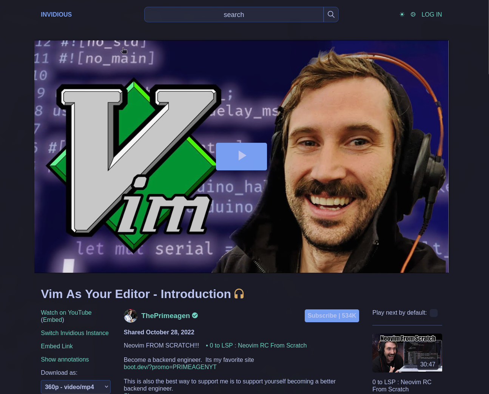
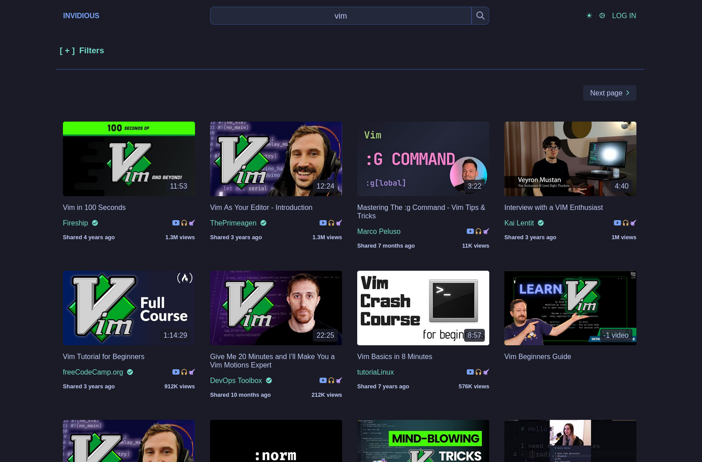

# Patch based instance of Invidious



<br/>
<br/>
Fork of the Invidious project: https://github.com/iv-org/invidious

Heavily inspired by the Nerdvpns patched based invidious instance: <https://git.nerdvpn.de/NerdVPN.de/invidious>

## Background

To protect my privacy I decided use invidious but to avoid overloading the public instances I decided to self host my own instance.

Public instances can be found here <https://redirect.invidious.io/>

## Get started

To get started make sure to read the official documentation at <https://docs.invidious.io/> and how to run invidious with gluetun <https://docs.invidious.io/gluetun/> unless you don't care about sharing your IP. Buuuut you probably should and gluetun is a great project which can be found here:<https://github.com/qdm12/gluetun>.

1. Copy the .env.example to .env:

```sh
touch .env && cp .env.example .env
```

2. Generate secret keys for hmac key and companion key by running:

```sh
# For INV_HMAC_KEY
pwgen 20 1
# For INV_COMPANION_KEY
pwgen 16 1
```

Don't forget to replace DB username and password in the .env file to your liking. Remember that the first time you run docker compose up the username and password will be set for the database so if you decide to change it you'll have to remove your volumes first.

3. Setup your gluetun container (see guide: <https://docs.invidious.io/gluetun/>) separately or in you docker compose though I'm running it separately due to other services using the same gluetun network. (This step can be ignored if you don't care about running invidious inside through a vpn)

4. Make sure your gluetun container is running (if you are using it, and/or if it's in a separate compose file).

5. Apply patches and build docker image:

```sh
./patch.sh # applies patches in ./patches/**
./build.sh release # or ./build.sh development for development build
```

6. Run docker compose with your latest built image:

```sh
docker compose up -d
```

## Update

To get the latest changes from the original invidious repo and re-apply the patches run:

```sh
./update.sh
./patch.sh
./build.sh release # or ./build.sh development for development build
```

## Warning

There is no guarantees that this project will run in your environment. And this project may stop working at any time due to changes in Youtube or invidious itself or just me breaking it.

## Honorable mentions

If you're interested in privacy respecting Youtube frontends you should also check out the following projects:

- <https://freetubeapp.io/>
- <https://newpipe.net/>
- <https://libretube.dev/>
